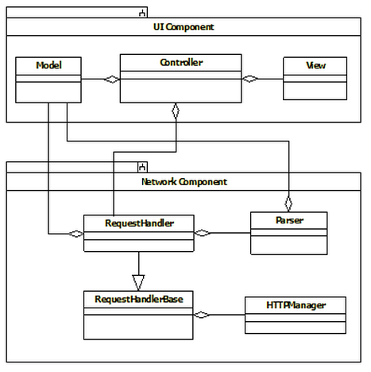

##1. Introduction

This document contains the Design architecture of [name] project.

###1.1  Purpose of the Document
The purpose of this document is to: 

- Identify various design approaches.
- Identify core modules of the system.
- Identify data structures and algorithm.
- Identify and finalize UI design in terms of technical implementation.

###1.2 Scope of the Document
The scope is determined on following factors:

- Platform: 
- Mobile:
    - Base-SDK: 
    - Orientation: 
    - Device:
    - Languages: 
- Service-Response: 

###1.3 Goals and Guidelines
Primary goal of this design is to make a memory efficient and responsive native application. Hence effective memory management needs to be taken care during development. We also need to assure that we reuse the code as much as possible.

##2. Application Architecture Framework
###2.1 Architecture        

##3. Application Component Description
###3.1 Network Component
This component will provide the functionality of Request Response handler, which will connect to a remote url and fetch data. It has been divided into three parts:

- `HttpManager`  
This class is responsible to send and fetch the data from server. This class  deals with UrlConnection to send/receive the data from server 
- `RequestHandlerBase`  
 This class is a base class of each RequestHandler class with respect to relative module.  It holds the common functionality of request handler and provides the service to `Request Handler` by inheritance. It conforms to the response returned by the HttpManager and sends it to its respective request handler.
- `Request Handler`  
It conforms to the response returned by RequestHandlerBase. This class creates the request and submits the created request. This class parses the response into data model and then notifies the controller towards the arrival of data. 

###3.2 UI Component
UI Component comprises of Model, View and Controller. This component is based on Model-View-Controller design pattern.
 
 - The model manages data of the application domain.
 - The view renders the model into a form suitable for interaction, typically a user interface element. Multiple views can exist for a single model for different purposes.
 - The controller receives user input and initiates a response by making calls on model objects. A controller accepts input from the user and instructs the model and view to perform actions based on that input.

##4. Application Modules
###4.1 Application Flow Architecture

###4.2 DB Schema

###4.3 Independent Modules 
This module is used to specify all the independent classes that can be access across the application and may be re-used across different projects.

1. Constant: This class will contain all the constant values i.e. anything which will not be changing and is used across the app. e.g. baseURL, keyboard height, etc. 
2. Constant String: This class contains all the constant alert strings, which will never change. 
3. Utils: A separate class for all the miscellaneous functionalities, which will contains mostly class methods. It may contain the method such as date manipulation, checking time range, etc. 

###4.4 Application Specific Modules

##5. Application Model Classes

##6. Web Architecture
###6.1 Server Configurations

 - Web Server:  
 - Operating System:
 - Database : 
 - Language : 

###6.2  Database Design

###6.3 Backend Design
                 
